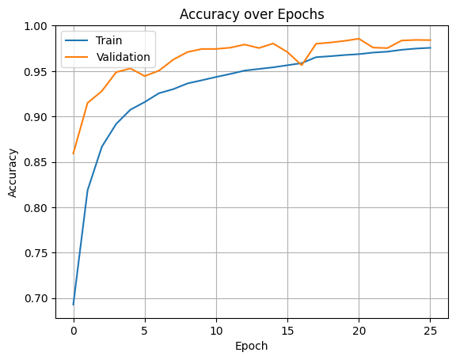
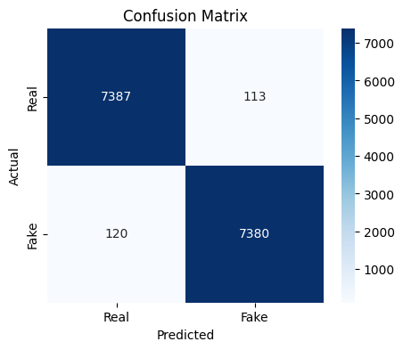

# Derin Öğrenme Android Uygulaması

Bu proje, yapay zeka ile üretilmiş görselleri gerçek görsellerden ayırt etmek için geliştirilmiş bir Android uygulamasıdır. TensorFlow Lite ve Firebase teknolojilerini kullanarak, kullanıcılara gerçek zamanlı görsel analizi sunmaktadır.

## 🚀 Özellikler

- 📱 Modern ve kullanıcı dostu arayüz
- 🔍 Gerçek zamanlı görsel analizi
- 📊 Detaylı istatistikler ve grafikler
- 🔔 Özelleştirilebilir bildirimler
- 🌙 Karanlık/Aydınlık tema desteği

## 🧠 Model Eğitimi

### Veri Seti
- [DeepDetect 2025](https://www.kaggle.com/datasets/ayushmandatta1/deepdetect-2025/data) veri seti kullanılmıştır
- Toplam 100,000 görsel (50,000 gerçek, 50,000 yapay)
- Veri seti train/validation/test olarak %70/%15/%15 oranında bölünmüştür

### Model Mimarisi
- Base Model: EfficientNetB0 (ImageNet ağırlıkları ile)
- Transfer Learning yaklaşımı
- Veri artırımı (Data Augmentation) teknikleri:
  - Yatay çevirme
  - Rastgele döndürme
  - Yakınlaştırma
  - Kontrast ve parlaklık ayarlamaları

### Eğitim Detayları
- Optimizer: Adam (learning rate: 1e-4)
- Loss Function: Binary Focal Loss
- Batch Size: 32
- Image Size: 224x224
- Early Stopping ve Learning Rate Reduction implementasyonu
- Sınıf ağırlıkları: {0: 1.2, 1: 1.0}

## 🛠️ Kullanılan Teknolojiler

### Frontend
- Kotlin
- Material Design 3
- MPAndroidChart (Grafikler için)
- Glide (Resim işleme)

### Backend
- Firebase Authentication
- Firebase Firestore
- Firebase Cloud Messaging
- TensorFlow Lite

### Diğer
- WorkManager (Zamanlanmış görevler)
- Room Database (Yerel veritabanı)

## 📱 Ekranlar

1. **Giriş/Üye Olma**
   - Email/Şifre ile giriş
   - Üye olma formu
   - Şifremi unuttum

2. **Ana Ekran**
   - Model tahmin özelliği
   - Kullanıcı bilgileri
   - Son tahminler
   - Bottom Navigation

3. **Geçmiş Tahminler**
   - Tahmin geçmişi listesi
   - Tarih ve sonuç bilgileri
   - Filtreleme özellikleri

4. **İstatistikler**
   - Başarı oranı grafiği
   - Günlük/haftalık/aylık istatistikler
   - Performans metrikleri

5. **Ayarlar & Profil**
   - Kullanıcı bilgileri
   - Tema değiştirme
   - Bildirim ayarları

## 🔧 Kurulum

1. Projeyi klonlayın
```bash
git clone https://github.com/blldlgc/real-or-ai-face.git
```

2. Android Studio'da açın

3. Firebase projenizi oluşturun ve `google-services.json` dosyasını ekleyin

4. Gerekli bağımlılıkları yükleyin
```bash
./gradlew build
```

## 📊 Model Performansı

Modelimiz, derin öğrenme tabanlı bir yaklaşımla yapay zeka ile üretilmiş görselleri gerçek görsellerden ayırt etmede yüksek başarı göstermiştir.

### Performans Metrikleri
- Accuracy: %97.60
- ROC-AUC Score: 0.9986

### Detaylı Performans Analizi

<table>
<tr>
<td align="center">

<br>
Accuracy Grafiği
</td>
<td align="center">

<br>
Confusion Matrix
</td>
<td align="center">

<br>
ROC Eğrisi
</td>

</tr>
</table>

## 🤝 Katkıda Bulunma

1. Fork'layın
2. Feature branch oluşturun (`git checkout -b feature/amazing-feature`)
3. Değişikliklerinizi commit edin (`git commit -m 'feat: Add amazing feature'`)
4. Branch'inizi push edin (`git push origin feature/amazing-feature`)
5. Pull Request oluşturun

## 📝 Lisans

Bu proje MIT lisansı altında lisanslanmıştır. Detaylar için [LICENSE](LICENSE) dosyasına bakın.

## 📞 İletişim

Proje Sahipleri:
- [Bilal Dalgıç](https://github.com/blldlgc)
- [Betül Şen](https://github.com/Btlsn)

Proje Linki: [https://github.com/blldlgc/real-or-ai-face](https://github.com/blldlgc/real-or-ai-face) 
